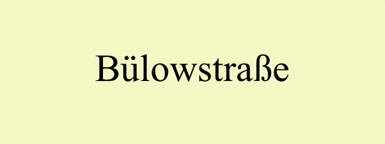
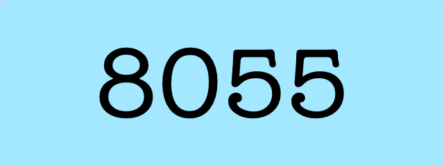

# Tesseract OCR for PHP

A wrapper to work with Tesseract OCR inside PHP.

[![Build Status][travisci_badge]][travisci]
[![Build Status][appveyor_badge]][appveyor]
[![Codacy Badge][codacy_badge]][codacy]
[![Test Coverage][test_coverage_badge]][test_coverage]
[![Minimum PHP Version][min_php_version_badge]][php]
<br/>
[![Latest Stable Version][stable_version_badge]][packagist]
[![Total Downloads][total_downloads_badge]][packagist]
[![Join the chat][gitter_badge]][gitter]
[![License][license_badge]][mit_license]
[![Tweet][twitter_badge]][tweet_intent]

## Installation

Via [Composer][]:

    $ composer require thiagoalessio/tesseract_ocr

This library depends on [Tesseract OCR][], version **3.03** or later.

<br/>

### ![][windows_icon] Note for Windows users

There are [many ways][tesseract_installation_on_windows] to install
[Tesseract OCR][] on your system, but if you just want something quick to
get up and running, I recommend installing the [Capture2Text][] package with
[Chocolatey][].

    choco install capture2text

<br/>

### ![][macos_icon] Note for macOS users

With [MacPorts][] you can install support for individual languages, like so:

    $ sudo port install tesseract-<langcode>

But that is not possible with [Homebrew][]. It comes only with **English** support
by default, so if you intend to use it for other language, the quickest solution
is to install them all:

    $ brew install tesseract --with-all-languages

<br/>

## Usage

### Basic usage


```php
use thiagoalessio\TesseractOCR\TesseractOCR;
echo (new TesseractOCR('text.png'))
    ->run();
```

```
The quick brown fox
jumps over
the lazy dog.
```

<br/>

### Other languages



```php
use thiagoalessio\TesseractOCR\TesseractOCR;
echo (new TesseractOCR('german.png'))
    ->lang('deu')
    ->run();
```

```
Bülowstraße
```

<br/>

### Multiple languages


```php
use thiagoalessio\TesseractOCR\TesseractOCR;
echo (new TesseractOCR('mixed-languages.png'))
    ->lang('eng', 'jpn', 'spa')
    ->run();
```

```
I eat すし y Pollo
```

<br/>

### Inducing recognition



```php
use thiagoalessio\TesseractOCR\TesseractOCR;
echo (new TesseractOCR('8055.png'))
    ->whitelist(range('A', 'Z'))
    ->run();
```

```
BOSS
```

<br/>

### Breaking CAPTCHAs

Yes, I know some of you might want to use this library for the *noble* purpose
of breaking CAPTCHAs, so please take a look on this comment:

<https://github.com/thiagoalessio/tesseract-ocr-for-php/issues/91#issuecomment-342290510>

## API

### executable

Define a custom location of the `tesseract` executable,
if by any reason it is not present in the `$PATH`.

```php
echo (new TesseractOCR('img.png'))
    ->executable('/path/to/tesseract')
    ->run();
```

### tessdataDir

Specify a custom location for the tessdata directory.

```php
echo (new TesseractOCR('img.png'))
    ->tessdataDir('/path')
    ->run();
```

### userWords

Specify the location of user words file.

This is a plain text file containing a list of words that you want to be
considered as a normal dictionary words by `tesseract`.

Useful when dealing with contents that contain technical terminology, jargon,
etc.

```
$ cat /path/to/user-words.txt
foo
bar
```

```php
echo (new TesseractOCR('img.png'))
    ->userWords('/path/to/user-words.txt')
    ->run();
```

### userPatterns

Specify the location of user patterns file.

If the contents you are dealing with have known patterns, this option can help
a lot tesseract's recognition accuracy.

```
$ cat /path/to/user-patterns.txt'
1-\d\d\d-GOOG-441
www.\n\\\*.com
```

```php
echo (new TesseractOCR('img.png'))
    ->userPatterns('/path/to/user-patterns.txt')
    ->run();
```

### lang

Define one or more languages to be used during the recognition.
A complete list of available languages can be found [here][tesseract_langs].

__Tip from [@daijiale][]:__ Use the combination `->lang('chi_sim', 'chi_tra')`
for proper recognition of Chinese.

```php
 echo (new TesseractOCR('img.png'))
     ->lang('lang1', 'lang2', 'lang3')
     ->run();
```

### psm

Specify the Page Segmentation Mode, which instructs `tesseract` how to
interpret the given image.

Possible `psm` values are:

| Value | Description                                               |
| -----:| --------------------------------------------------------- |
| 0     | Orientation and script detection (OSD) only.              |
| 1     | Automatic page segmentation with OSD.                     |
| 2     | Automatic page segmentation, but no OSD, or OCR.          |
| 3     | Fully automatic page segmentation, but no OSD. (Default)  |
| 4     | Assume a single column of text of variable sizes.         |
| 5     | Assume a single uniform block of vertically aligned text. |
| 6     | Assume a single uniform block of text.                    |
| 7     | Treat the image as a single text line.                    |
| 8     | Treat the image as a single word.                         |
| 9     | Treat the image as a single word in a circle.             |
| 10    | Treat the image as a single character.                    |

```php
echo (new TesseractOCR('img.png'))
    ->psm(6)
    ->run();
```

### whitelist

This is a shortcut for `->config('tessedit_char_whitelist', 'abcdef....')`.

```php
echo (new TesseractOCR('img.png'))
    ->whitelist(range('a', 'z'), range(0, 9), '-_@')
    ->run();
```

### Other options

Tesseract offers incredible control to the user through its 600+ configuration options.
You can see the complete list by running the following command:

```
$ tesseract --print-parameters
Tesseract parameters:
... long list with all parameters ...
```

```php
echo (new TesseractOCR('img.png'))
    ->config('config_var', 'value')
    ->config('other_config_var', 'other value')
    ->run();

// or better yet, just cammel case any of the options:

echo (new TesseractOCR('img.png'))
    ->configVar('value')
    ->otherConfigVar('other value')
    ->run();
```

## Where to get help

Join the chat at <https://gitter.im/thiagoalessio/tesseract-ocr-for-php>

## License

tesseract-ocr-for-php is released under the [MIT License][].


<h2></h2><p align="center"><sub>Made with <sub><a href="#"></a></sub> in Berlin</sub></p>

[travisci_badge]: https://travis-ci.org/thiagoalessio/tesseract-ocr-for-php.svg?branch=master
[travisci]: https://travis-ci.org/thiagoalessio/tesseract-ocr-for-php
[appveyor_badge]: https://ci.appveyor.com/api/projects/status/xwy5ls0798iwcim3/branch/master?svg=true
[appveyor]: https://ci.appveyor.com/project/thiagoalessio/tesseract-ocr-for-php/branch/master
[codacy_badge]: https://api.codacy.com/project/badge/Grade/024c8814aecf40329500df267134c623
[codacy]: https://www.codacy.com/app/thiagoalessio/tesseract-ocr-for-php?utm_source=github.com&amp;utm_medium=referral&amp;utm_content=thiagoalessio/tesseract-ocr-for-php&amp;utm_campaign=Badge_Grade
[test_coverage_badge]: https://api.codacy.com/project/badge/Coverage/024c8814aecf40329500df267134c623
[test_coverage]: https://www.codacy.com/app/thiagoalessio/tesseract-ocr-for-php?utm_source=github.com&utm_medium=referral&utm_content=thiagoalessio/tesseract-ocr-for-php&utm_campaign=Badge_Coverage
[min_php_version_badge]: https://img.shields.io/badge/php-%3E%3D%205.6-8892BF.svg
[php]: https://php.net/
[stable_version_badge]: https://poser.pugx.org/thiagoalessio/tesseract_ocr/v/stable
[total_downloads_badge]: https://poser.pugx.org/thiagoalessio/tesseract_ocr/downloads
[packagist]: https://packagist.org/packages/thiagoalessio/tesseract_ocr
[gitter_badge]: https://badges.gitter.im/thiagoalessio/tesseract-ocr-for-php.svg
[gitter]: https://gitter.im/thiagoalessio/tesseract-ocr-for-php?utm_source=badge&utm_medium=badge&utm_campaign=pr-badge&utm_content=badge
[license_badge]: https://poser.pugx.org/thiagoalessio/tesseract_ocr/license
[mit_license]: https://opensource.org/licenses/MIT
[twitter_badge]: https://img.shields.io/twitter/url/http/shields.io.svg?style=social
[tweet_intent]: https://twitter.com/intent/tweet?text=tesseract-ocr-for-php%3A%20A%20wrapper%20to%20work%20with%20Tesseract%20OCR%20inside%20PHP.&url=https://github.com/thiagoalessio/tesseract-ocr-for-php&hashtags=php,tesseract,ocr
[Tesseract OCR]: https://github.com/tesseract-ocr/tesseract
[Composer]: http://getcomposer.org/
[windows_icon]: https://thiagoalessio.ams3.digitaloceanspaces.com/windows-18.svg
[macos_icon]: https://thiagoalessio.ams3.digitaloceanspaces.com/apple-18.svg
[tesseract_installation_on_windows]: https://github.com/tesseract-ocr/tesseract/wiki#windows
[Capture2Text]: https://chocolatey.org/packages/capture2text
[Chocolatey]: https://chocolatey.org
[MacPorts]: https://www.macports.org
[Homebrew]: https://brew.sh
[FAQ for Windows Users]:https://github.com/thiagoalessio/tesseract-ocr-for-php/wiki/FAQ-for-Windows-Users
[tesseract_langs]: https://github.com/tesseract-ocr/tesseract/blob/master/doc/tesseract.1.asc#languages
[@daijiale]: https://github.com/daijiale
[MIT License]: https://github.com/thiagoalessio/tesseract-ocr-for-php/blob/master/MIT-LICENSE
